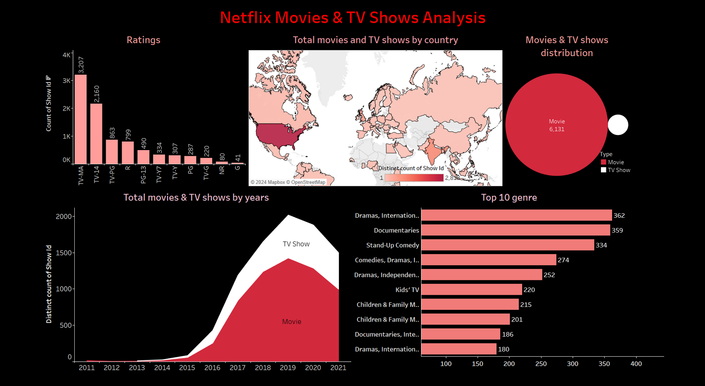
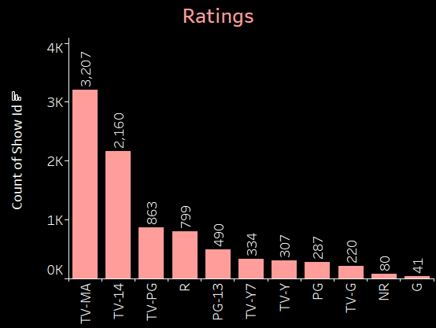
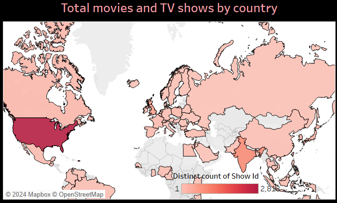
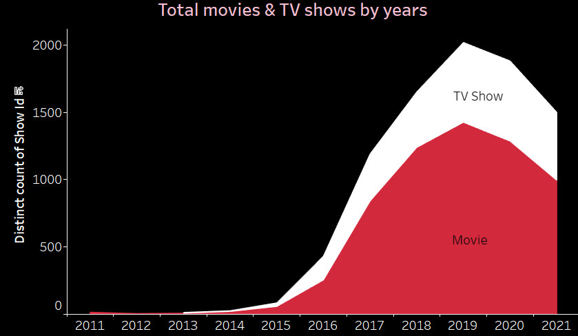
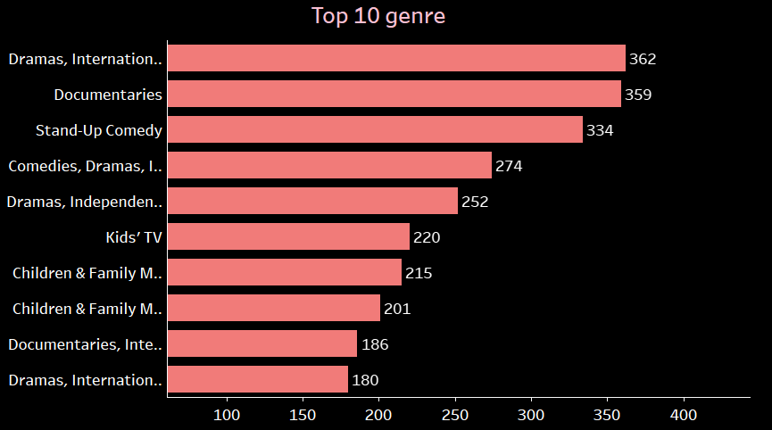

# Netflix Movies & TV Shows Analysis Dashboard

An interactive Tableau dashboard analyzing Netflix's content library — covering genres, viewer ratings, regional distribution, and content growth over time — built from a public dataset of 8,800+ titles.

## About

This dashboard dives into Netflix's catalog of movies and TV shows, using data visualization to uncover patterns in content type, ratings, geography, and genre popularity. The goal was to understand what trends and factors influence content variety and viewer engagement on the platform.

## Tools Used
- Tableau
- Dataset: [Netflix Movies and TV Shows (Kaggle)](https://www.kaggle.com/datasets/shivamb/netflix-shows)

## Key Insights
- **Ratings**: TV-MA and TV-14 dominate the catalog, with over 3,200 and 2,100 titles respectively — Netflix skews toward mature audiences.
- **Geography**: The United States leads total content by a wide margin, followed by India and the UK.
- **Content Type**: Movies make up the majority of the library (6,131 titles) compared to TV Shows.
- **Growth Over Time**: Content additions grew sharply from 2015–2019, peaking around 2019 before leveling off.
- **Top Genres**: International Dramas, Documentaries, and Stand-Up Comedy are the most common genres on the platform.

## Dashboard Panels

| Ratings Distribution | Content by Country |
|---|---|
|  |  |

| Content Growth by Year | Top 10 Genres |
|---|---|
|  |  |

## Files in This Repo
- `NetflixDashboard_1_.twbx` — the full interactive Tableau workbook
- `netflix_titles.csv` — the raw dataset used for analysis
- Dashboard panel images (above)

## Conclusion
This analysis revealed key insights into Netflix viewer preferences and content trends — from rating distribution to regional content concentration — demonstrating how interactive dashboards can support data-driven decision-making.
